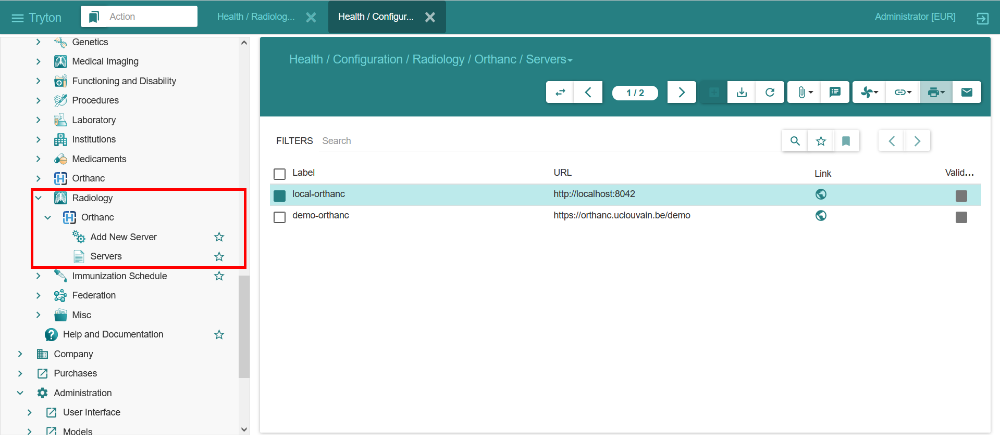
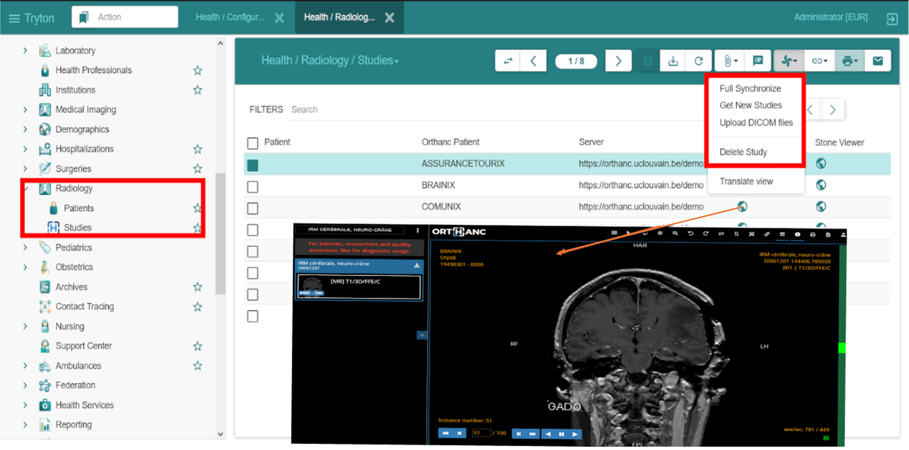

.. _Radiology:

The aim of this project is to connect the PACS Orthanc server to GNU Health, allowing GNU Health users to access patient radiology data. A new GNU Health module has been developed to configure the connection and to manage DICOM image data. Since GNU Health and Orthanc have different representations of patients, the module provides a mapping that links GNU Health patient identities to studies in Orthanc. 

Orthanc Server Configuration
=============================

The primary role of the functions at "Health/Configuration/Radiology/Orthanc" is to configure the connection between GNU Health and one or more Orthanc servers. The label of a server is a name that the user can choose. The domain field contains the URL (including port number) of the Orthanc server. The user must also provide a username and password to log in to the Orthanc server. The image below shows a screenshot of the "Servers" view:

Configuration
-------------

This function is used to connect to an Orthanc DICOM server and verify the connection to the corresponding domain. The following information is required to configure the connection:

    - ``label``: Represents the label of the Orthanc server. Must be unique.

    - ``domain``: Represents the full URL of the Orthanc server.

    - ``user``: Represents the username for the Orthanc REST server.

    - ``password``: Represents the password for the Orthanc REST server.

Radiology
=========

This is the core function of the Orthanc integration. It allows to uploading and updating patient images, as well as to view these images using Orthanc DICOM viewers. The image below shows a snapshot of the radiology module:

.. image:: images/radiology_module.png
    :width: 400
    :height: 180
    :align: center
    :alt: GNU Health Radiology Module

Data Models for image data
--------------------------

In this module we have developed three data models to organize image study data according to the DICOM format. These models represent studies, series within studies (such as CT, MR or PET scans) and the individual instances within each series. They represent the relationships between these elements. For example, a single patient may undergo multiple studies, each study may consist of multiple series, and each series may contain multiple instances.

    - ``PatientOrthancStudy``: defines a model for patient image study.

    - ``radiology_study_series``: defines the series of the image study.

    - ``SeriesInstances``: instances of study series.

New features for managing the image data
-----------------------------------------

    - ``Upload DICOM files``: Uploading DICOM image data to Orthanc server.

    - ``Full Synchronize``: Full synchronizing studies. It updates the studies in the GNU Health database by fetching studies from the Orthanc servers and creating new studies if needed.

    - ``Get New studies``: Updating studies from an Orthanc server by processing changes to studies, series and instances. It retrieves configuration information, fetches changes from the Orthanc server and updates the studies in the GNU Health database.

The following shows the outcome of the integration between GNU Health and Orthanc:

